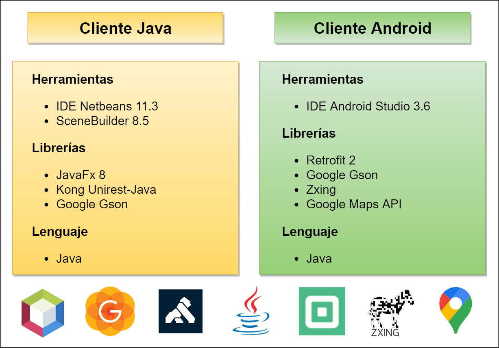
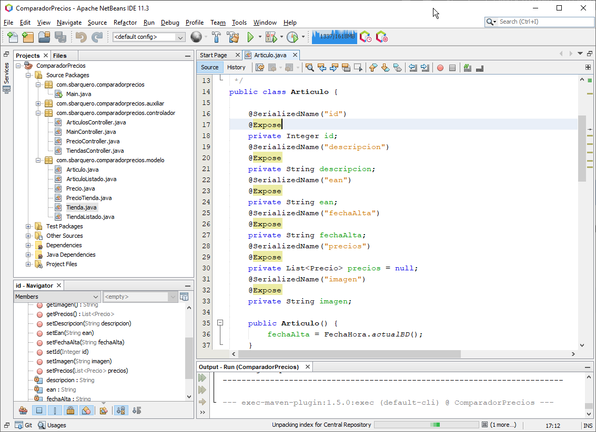
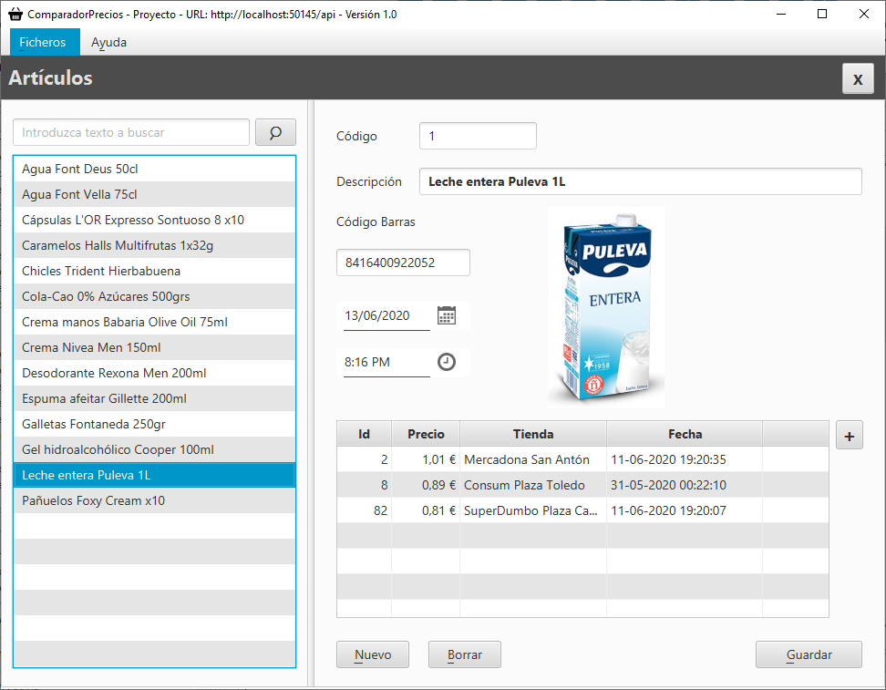
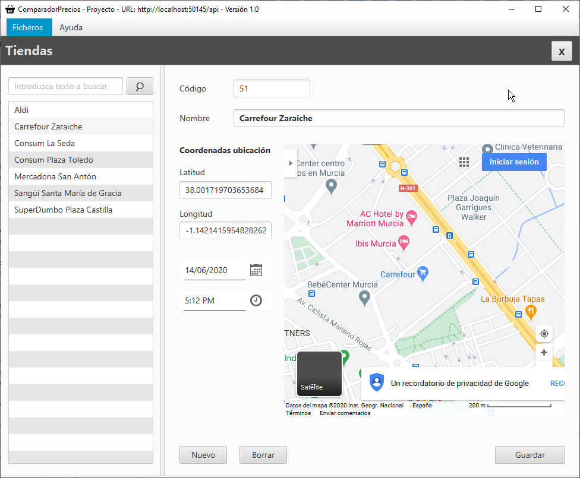
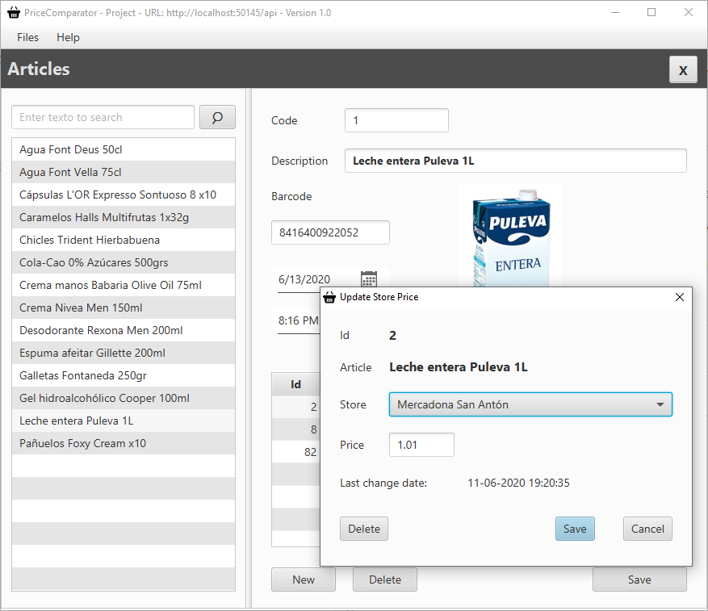

# ComparadorPrecios_Java

Proyecto **Apache NetBeans 11.3** de aplicación **Cliente de escritorio Java** para mi **Proyecto de Cicle 2º DAM**. La aplicación interacciona con la **web API ComparadorPrecios** [(Enlace Github)](https://github.com/sbarquero/ComparadorPrecios_WebAPI).

## Introducción

El proyecto desarrollado pretende ser sobre todo una prueba de concepto de un sistema que consiste en lo siguiente:

- Un servicio web **API RESTful** en un servidor que responde a peticiones de clientes y que almacena sus datos en una base de datos PostgreSQL [(Enlace GitHub)](https://github.com/sbarquero/ComparadorPrecios_WebAPI)
- Una **aplicación cliente multiplataforma** desarrollada en **Java** y que consume los servicios proporcionados por la web API (Este proyecto).
-  Una **aplicación cliente para Android** que consume los servicios de la web API [(Enlace GitHub)](https://github.com/sbarquero/ComparadorPrecios_Android) 

## Características

- Se han empleado las siguientes herramientas y librerías:

    - IDE **Apache NetBeans 11.3**
    - **Scenebuilder 8.5**
    - **JavaFx 8**
    - Google **Gson**
    - Kong **Unirest**

- Está implementada la **internacionalización** (**i18n**)

## Puesta en marcha

Abrir proyecto con el **IDE Apache Netbeans 11.3** y ejecutar.

## Capturas de pantalla

### Artículos

### Tiendas

### Precios e internacionalización en inglés

